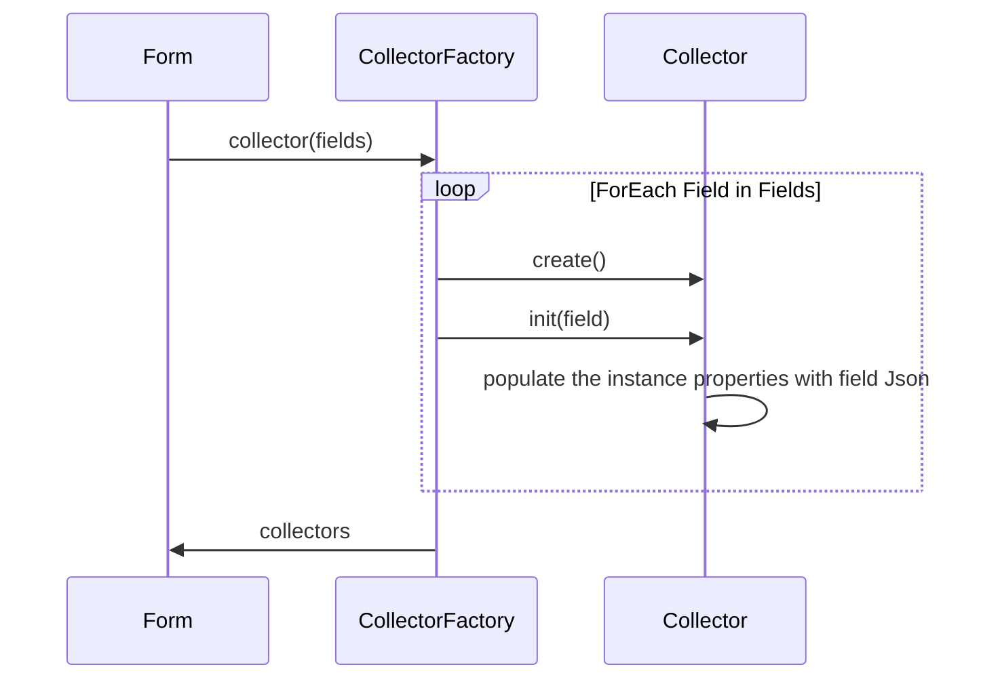
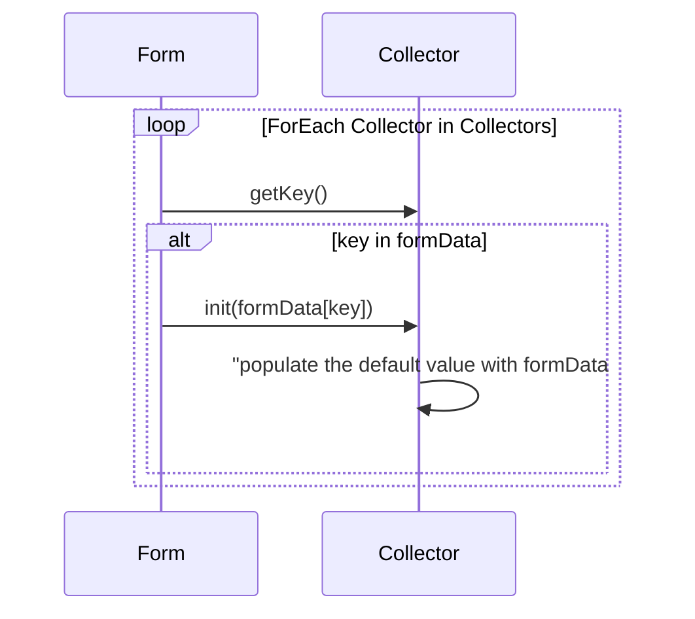
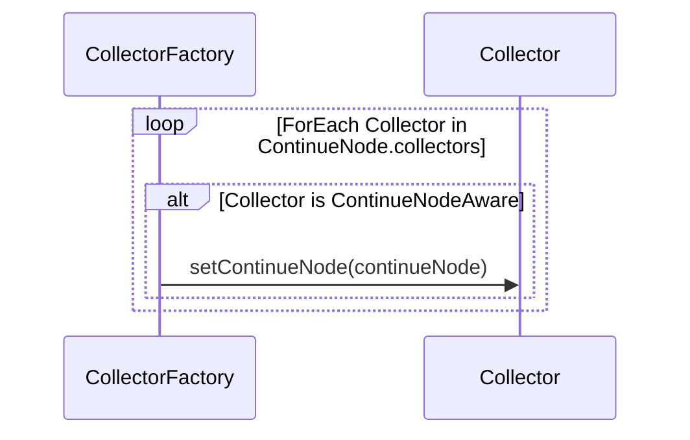

<p align="center">
  <a href="https://github.com/ForgeRock/ping-android-sdk">
    
  </a>
  <hr/>
</p>

# Design Concept

## How Collector map with Field Type

CollectorFactory is a factory class that maps the Field Type to the Collector, to register a new Collector, provide the
Field Typeas String and the Collector's Type. With the Collector's Type, the CollectorFactory can create
the Collector during parsing the DaVinci Response JSON.

```
CollectorFactory().register(<FieldTypeString>, <Collector.Type>)
```

For example:

```swift
// Map Password Type to PasswordCollector
CollectorFactory.shared.register(type: "PASSWORD", collector: PasswordCollector.self)

CollectorFactory.shared.register(type: "SUBMIT_BUTTON", collector: SubmitCollector.self)

// Allow to map multiple Field Type to the same Collector
CollectorFactory.shared.register(type: "FLOW_BUTTON", collector: FlowCollector.self)
CollectorFactory.shared.register(type: "FLOW_LINK", collector: FlowCollector.self)

```

## How Collector is created & initialized

DaVinci Response JSON:

```json
{
  "form": {
    "components": {
      "fields": [
        {
          "type": "TEXT",
          "key": "user.username",
          "label": "Username",
          "required": true,
          "validation": {
            "regex": "^[^@]+@[^@]+\\.[^@]+$",
            "errorMessage": "Must be alphanumeric"
          }
        },
        {
          "type": "PASSWORD",
          "key": "password",
          "label": "Password",
          "required": true
        },
        ...
      ]
    }
  }
}
```



## How Collector populate default value

The Collector populates the default value from the `formData` JSON:

```json
{
  "formData": {
    "value": {
      "user.username": "",
      "password": "",
      "dropdown-field": "",
      "combobox-field": [],
      "radio-field": "",
      "checkbox-field": []
    }
  }
}
```



## How Collector access ContinueNode

The Collector is self-contained and does not have access to the ContinueNode by default. The Collector itself handle
how to collect data from the user and how to validate the data. However, in some scenarios the Collector needs to access
the ContinueNode. For example, the Collector needs to access the root JSON to get the `passwordPolicy` to validate the
password.

To allow the Collector to access the ContinueNode, the Collector can implement the `ContinueNodeAware` protocol.
The `ContinueNodeAware` interface provides the `continueNode` property to access the ContinueNode. After Collector is
created, the ContinueNode will be injected to the Collector.

```swift
public class PasswordCollector: ContinueNodeAware {
    public var continueNode: ContinueNode?
}
```


