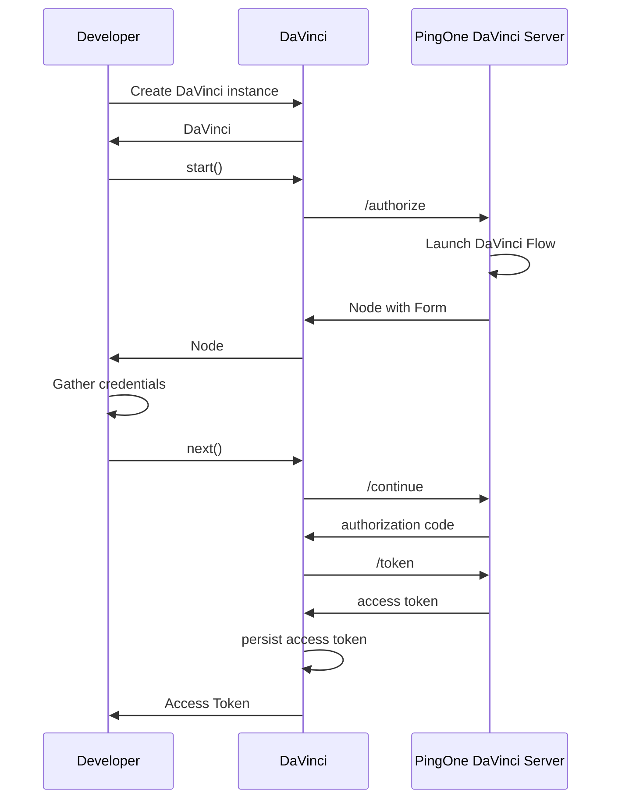

<p align="center">
  <a href="https://github.com/ForgeRock/ping-ios-sdk">
    
  </a>
  <hr/>
</p>

# PingDavinci

## Overview

PingDavinci is a powerful and flexible library for Authentication and Authorization. It is designed to be easy to use and extensible. It provides a simple API for navigating the authentication flow and handling the various states that can occur during the authentication process.



You can find more information about PingOne
DaVinci [here](https://docs.pingidentity.com/davinci/davinci_introduction.html).

## Integrating the SDK into your project

Use Cocoapods or Swift Package Manger

## Usage

To use the `DaVinci` class, you need to create an instance of it by passing a configuration block to the `createDaVinci` method. The configuration block allows you to customize various aspects of the `DaVinci` instance, such as the timeout and logging.

Here's an example of how to create a `DaVinci` instance:

```swift
let daVinci = DaVinci.createDaVinci { config in
            // Oidc as module
            config.module(OidcModule.config) { oidcValue in
                oidcValue.clientId = "test"
                oidcValue.discoveryEndpoint = "https://auth.test-one-pingone.com/0c6851ed-0f12-4c9a-a174-9b1bf8b438ae/as/.well-known/openid-configuration"
                oidcValue.scopes = ["openid", "email", "address"]
                oidcValue.redirectUri = "org.forgerock.demo://oauth2redirect"
            }
        }
var node = await daVinci.start()
node = await (node as! ContinueNode).next()
```

The `PingDavinci` depends on `PingOidc` module. It discovers the OIDC endpoints with `discoveryEndpoint` attribute.

The `start` method returns a `Node` instance. The `Node` class represents the current state of the application. You can use the `next` method to transition to the next state.

## More DaVinci Configuration
```swift
let daVinci = DaVinci.createDaVinci { config in
    config.timeout = 30
    config.logger = LogManager.standard
    config.module(OidcModule.config) { oidcValue in
        //...
        oidcValue.storage = MemoryStorage<Token>()
    }
}
```


### Navigate the authentication Flow

```swift
let node = await daVinci.start() //Start the flow

//Determine the Node Type
switch (node) {
case is ContinueNode: do {}
case is ErrorNode: do {}
case is FailureNode: do {}
case is SuccessNode: do {}
        }
```

| Node Type  | Description                                                                                               |
|------------|:----------------------------------------------------------------------------------------------------------|
| ContinueNode  | In the middle of the flow, call ```node.next``` to move to next Node in the flow.                          |
| FailureNode  | Unexpected error, e.g., network issues. Use  ```node.cause``` to retrieve the cause of the error.                |
| ErrorNode| Bad request from the server, e.g., invalid password, OTP or username. Use ```node.message``` for the error message. |
| SuccessNode| Successful authentication. Use ```node.session``` to retrieve the session.                                      |

### Provide input
For a `ContinueNode`, you can access the list of collectors using `node.collectors` and and provide input to the desired `Collector`. Currently, the available collectors include `TextCollector`, `PasswordCollector`, `SubmitCollector`, `FlowCollector`, `LabelCollector`, `MultiSelectCollector`, and `SingleSelectCollector`. Additional collectors, such as `Fido` and `IdpCollector`, will be added in the future.

To access the collectors, you can use the following code:
```swift
node.collectors.forEach { item in
    switch(item) {
    case is TextCollector:
        (item as! TextCollector).value = "My First Name"
    case is PasswordCollector:
        (item as! PasswordCollector).value = "My Password"
    case is SubmitCollector:
        (item as! SubmitCollector).value = "click me"
    case is FlowCollector:
        (item as! FlowCollector).value = "Forgot Password"
    ...
    }
}

//Move to next Node, and repeat the flow until it reaches `SuccessNode` or `ErrorNode` Node
let next = node.next()
```

Each `Collector` has its own function.

#### TextCollector (TEXT)

```swift
textCollector.label //To access the label
textCollector.key //To access the key attribute
textCollector.type //To access the type attribute
textCollector.required //To access the required attribute
textCollector.validation //To access the validation attribute

textCollector.validate() //To validate the field's input value using both required and regex constraints.
textCollector.value = "My First Name" //To set the value
```

#### PasswordCollector (PASSWORD, PASSWORD_VERIFY)

`PasswordCollector` has the same attributes as `TextCollector`, plus the following functions

```swift
passwordCollector.passwordPolicy() //Retrieve the password policy
passwordCollector.validate() //To validate the field input value against the password policy

passwordCollector.type == "PASSWORD_VERIFY" // Check if the type is "PASSWORD_VERIFY".
```

#### SubmitCollector (SUBMIT_BUTTON)

```swift
submitCollector.label //To access the label
submitCollector.key //To access the key attribute
submitCollector.type //To access the type attribute
submitCollector.value = "submit" //To set the value
```

#### FlowCollector (FLOW_BUTTON, FLOW_LINK)

`FlowCollector` has the same attributes as `SubmitCollector`

```swift
flowCollector.type == "FLOW_LINK" // Check if the type is "FLOW_LINK". Note that developers may choose to display flow collectors as link or button. 
```

#### LabelCollector (LABEL)

```swift
labelCollector.content //To access the Content
```

#### MultiSelectCollector (COMBOBOX, CHECKBOX)

```swift
multiSelectCollector.label //To access the label
multiSelectCollector.key //To access the key attribute
multiSelectCollector.type //To access the type attribute
multiSelectCollector.required //To access the required attribute
multiSelectCollector.options //To access the options attribute

multiSelectCollector.value.append("option1") //To add the value
```

#### SingleSelectCollector (DROPDOWN, RADIO)

```swift
singleSelectCollector.label //To access the label
singleSelectCollector.key //To access the key attribute
singleSelectCollector.type //To access the type attribute
singleSelectCollector.required //To access the required attribute
singleSelectCollector.options //To access the options attribute

singleSelectCollector.value = "option1" //To set the value
```

### Collector Validation

Collectors have a `validate()` method to validate the input value. The `validate()` method will return array of `ValidationError`

For example, to validate the `TextCollector` input value, you can use the following code:

```swift
var result: [ValidationError] = = textCollector.validate()
```

| ValidationError | Description                                                                                                                                                                                               |
|-----------------|:----------------------------------------------------------------------------------------------------------------------------------------------------------------------------------------------------------|
| .invalidLength   | Indicates that the password length is outside the valid range. The InvalidLength error includes the required minimum and maximum lengths.                                                                 |
| .uniqueCharacter | Indicates that the number of unique characters is less than the required minUniqueCharacters specified in the the policy. The UniqueCharacter error contains the required minimum unique character count. |
| .maxRepeat       | Indicates that the maxRepeatedCharacters policy requirement is not met. The MaxRepeat error specifies the maximum allowed repetitions of a character.                                                     |
| .minCharacters   | Indicates that the minCharacters password policy requirement is not met.                                                                                                                                  |
| .required        | Indicates that the input value has not been supplied, but is required.                                                                                                                                    |
| .regex           | Indicates that the input value does not match the required pattern. The Regex error contains the required regular expression.                                                                             |

### Error Handling

`FailureNode` and `ErrorNode` handle errors differently in the flow. A `FailureNode` represents an unrecoverable error that prevents the flow from continuing, whereas an `ErrorNode` allows the flow to continue and provides an error message for the user.

For a `FailureNode` Node, you can retrieve the cause of the error using `node.cause`. The `cause` is an `Error` instance. When an error occurs, the flow cannot continue, and you may want to display a generic message to the user and report the issue to the support team. Possible errors include network issues, parsing problems, API errors (e.g., server responses in the 5xx range), and other unexpected issues.

For an `ErrorNode` Node, you can retrieve the error message using `node.message` and access the raw JSON response with
`node.input`. 
The `message` is a `String` object. When a failure occurs, you can continue the flow with the previous `ContinueNode`, but you may want to display the error message to the user (e.g., "Username/Password is incorrect", "OTP is invalid", etc.).
```swift
let node = await daVinci.start() //Start the flow

//Determine the Node Type
switch (node) {
case is ContinueNode: do {}
case is FailureNode:
    (node as! FailureNode).cause //Retrieve the cause of the Failure
case is ErrorNode:
    (node as! ErrorNode).message //Retrieve the error message
    // Retrieve the details of the error
    (node as! ErrorNode).details.forEach { detail in
        detail.rawResponse.details?.forEach { detail in
            let msg = detail.message
            
            detail.innerError?.errors.forEach { key, value in
                let innerError = "\(key): \(value)"
            }
        }
    }
case is SuccessNode: do {}
}
```

### Node Identifier
You can use the `node.id` to identify the current state of the flow. The `id` is a unique identifier for each node.

For example, you can use the `id` to determine if the current state is `Forgot Passowrd`, `Registration`, etc....

```swift

var state = ""
switch (node.id) {
case "cq77vwelou": state = "Sign On"
case  "qwnvng32z3": state = "Password Reset"
case "4dth5sn269": state = "Create Your Profile"
case "qojn9nsdxh": state = "Verification Code"
case "fkekf3oi8e": state =  "Enter New Password"
default: state = ""
}
```

Other than `id`, you can also use `node.name` to retrieve the name of the Node, `node.description` to retrieve the description of the Node.


### Work with SwiftUI

ViewModel
```swift
//Define State that listen by the View

@Published var state: Node = EmptyNode()

//Start the DaVinci flow
let next = await daVinci.start()

//Update the state
state = next

func next(node: ContinueNode) {
   val next = await node.next()
   state = next
    
}
```

View
```swift
if let node = state.node {
    switch node {
    case is ContinueNode:
        // Handle ContinueNode case
        break
    case is ErrorNode:
        // Handle Error case
        break
    case is FailureNode:
        // Handle Failure case
        break
    case is SuccessNode:
        // Handle Success case
        break
    default:
        break
    }
}
```

### Post Authentication
After authenticate with DaVinci, the user session will be stored in the storage.
To retrieve the existing session, you can use the following code:

```swift
//Retrieve the existing user, if token exists in the storage, ```user``` will be not nil.
//However, even with the user object, you may not be able to retrieve a valid token, as the token and refresh token may be expired.

let user: User? = await daVinci.user()

_ = await user?.token()
await user?.revoke()
_ = await user?.userinfo(cache: false)
await user?.logout()

```
