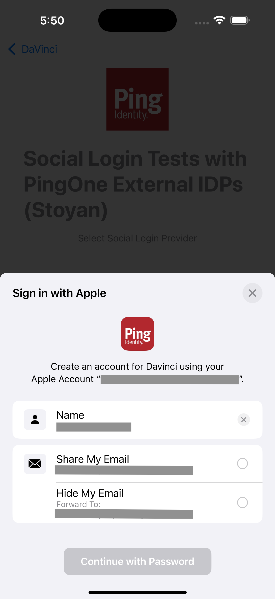

  
  

# Ping External IDP Apple

## Overview

Ping External IDP Apple is a library that allows you to authenticate with External IDP for Apple using native Sign in With Apple.
This library acts as a plugin to the `PingExternal-idp` library, and it provides the necessary configuration to authenticate with `Sign In with Apple` natively.

## Add dependency to your project

You can add the dependency using Cocoapods or Swift Package Manager.
Make sure the `PingExternal-idp-Apple` is included in the `Frameworks and Libraries` section of the `General` configuration pane in Xcode

## Usage

To use the `PingExternal-idp-Apple` with `IdpCollector`, you need to integrate with `PingDavinci` module.
Read more about Configuration and Usage in [PingExternal-idp](/External-idp/README.md)

If the library is present in the project, calling `IdpCollector.authorize()` will use native Sign in With Apple to perform the authentication.

### Enable the SIWA capability in Xcode

In the App project file go to `Target -> Signing and Capabilities` file, add the `Sign in with Apple` capability.

Follow the PingOne and DaVinci documentation to configuring the External IDP or Davinci Connector with Apple for a Sign in with Apple integration.