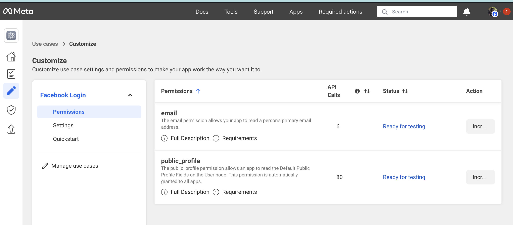

<p align="center">
  <a href="https://github.com/ForgeRock/ping-android-sdk">
    
  </a>
  <hr/>
</p>

# Ping External IDP Facebook

## Overview

Ping External IDP Faceboiok is a library that allows you to authenticate with External IDP for Facebook using the [facebook-ios-sdk](hhttps://github.com/facebook/facebook-ios-sdk) for Native iOS experience.
This library acts as a plugin to the `PingExternal-idp` library, and it provides the necessary configuration to authenticate with Facebook Login natively.

 

## Add dependency to your project

You can add the dependency using Cocoapods or Swift Package Manager
Make sure the `PingExternal-idp-Facebook` is included in the `Frameworks and Libraries` section of the `General` configuration pane in Xcode

## Usage

To use the `PingExternal-idp-Facebook` with `IdpCollector`, you need to integrate with `PingDavinci` module.
Read more about Configuration and Usage in [PingExternal-idp](/External-idp/README.md)

If the library is present in the project, calling `IdpCollector.authorize()` will use the Facebook iOS SDK to perform the authentication.

## Facebook Developer Console Configuration for Native Integration

Follow the official documentation provided by
the [Facebook Developer Console](https://developers.facebook.com/docs/facebook-login/ios) to set up your Facebook
app and integrate the Facebook SDK. This involves:

1. **Creating a Facebook App:** Register your application on the Facebook for Developers platform.
2. **Adding Facebook Login Product:** Enable the Facebook Login product for your app.
3. **Configuring iOS Platform:** Add your iOS platform details, including your app's Bundle ID.

Ensure that you have added the necessary permissions, such as `email` and `public_profile`, to your Facebook app
settings. These permissions will be requested from the user during the login process.



#### Configuring `Info.plist`

Add the following strings to your app's Info file, replacing the placeholders with your
actual Facebook App ID and Client Token:

```xml

    <key>FacebookAppID</key>
	<string>[your_facebook_app_id]</string>
	<key>FacebookClientToken</key>
	<string>[your_client_token]</string>

    <array>
    		<dict>
			<key>CFBundleTypeRole</key>
			<string>Editor</string>
			<key>CFBundleURLSchemes</key>
			<array>
				<string>fb[your_facebook_app_id]</string>
			</array>
		</dict>
	</array>

```

## Handle the authentication redirect URL

### UIKit: UIApplicationDelegate

```swift
func application(
  _ app: UIApplication,
  open url: URL, options: [UIApplication.OpenURLOptionsKey : Any] = [:]
) -> Bool {
  FacebookRequestHandler.handleOpenURL(UIApplication.shared, url: url, options: nil)
...
}
```

### SwiftUI

```swift
@main
struct MyApp: App {

  var body: some Scene {
    WindowGroup {
      ContentView()
        // ...
        .onOpenURL { url in
          FacebookRequestHandler.handleOpenURL(UIApplication.shared, url: url, options: nil)
        }
    }
  }
}
}
```