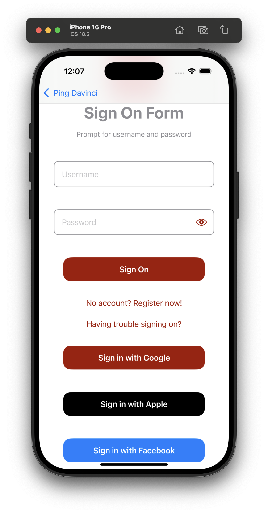

  
  

# Ping External IDP Google

## Overview

Ping External IDP Google is a library that allows you to authenticate with External IDP for Google using the Google Sign in SDK for Native iOS experience.
This library act as a plugin to the `PingExternal-idp` library,
and it provides the necessary configuration to authenticate with Sign In with Apple natively.

## Add dependency to your project

You can add the dependency using Cocoapods or Swift Package manager.
Make sure the `PingExternal-idp-Google` is included in the `Frameworks and Libraries` section of the `General` configuration pane in XCode

## Usage

To use the `PingExternal-idp-Google` with `IdpCollector`, you need to integrate with `DaVinci` module.
Setup `PingOne` with `External IDPs` and a `DaVinci` flow.
If the library is present in the project, calling `IdpCollector.authorize()` will use the Google Sign in SDK to perform the authentication.

Follow the PingOne and Davinci documentation to configuring the ExternalIDP or Davinci Connector with Google for a Native iOS Application.