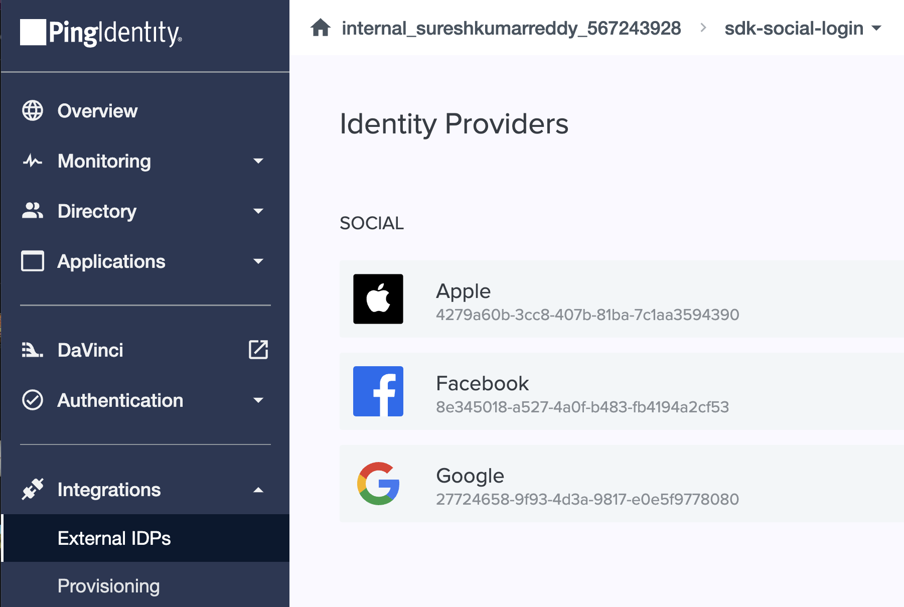

<p align="center">
  <a href="https://github.com/ForgeRock/ping-android-sdk">
    
  </a>
  <hr/>
</p>

# Ping External IDP

## Overview

Ping External IDP is a library that allows you to authenticate with External IDP, for example, Google, Facebook, Apple, etc...
This library act as a plugin to the `PingDavinci` library,
and it provides the necessary configuration to authenticate with the External IDP.


## Add dependency to your project

You can add the dependency using Cocoapods or Swift Package manager

## Usage

To use the `enternal-idp` with `IdpCollector`, you need to integrate with `DaVinci` module.
Setup `PingOne` with `External IDPs` and a `DaVinci` flow.

For Browser experience either setup the External IDPs with `PingOne External IDPs` or use the `DaVinci Connector`.
For Native experience the only option is to use the `DaVinci Connector`. (Not implemented yet)

### PingOne External IDPs Setup



### DaVinci Connector Setup


### DaVinci Flow Setup


For the `skIDP`, ensure the `Application Return to Url` configure with the `Custom URL Scheme` that you setup in the App.
for example:
```swift
myapp://callback
```

### App Redirect Uri Setup

In the App project file go to `Info -> URL Types` file, add the following `url scheme` to the project. The IdpCollector will use the first scheme as it appears on the list:


Here's an example of how to use the `IdpCollector` instance:

```swift
public class SocialButtonViewModel: ObservableObject {
    @Published public var isComplete: Bool = false
    public let idpCollector: IdpCollector
    
    public init(idpCollector: IdpCollector) {
        self.idpCollector = idpCollector
    }
    
    public func startSocialAuthentication() async -> Result<Bool, IdpExceptions> {
        return await idpCollector.authorize()
    }
    
    public func socialButtonText() -> some View {
        let bgColor: Color
        switch idpCollector.idpType {
        case "APPLE":
            bgColor = Color.appleButtonBackground
        case "GOOGLE":
            bgColor = Color.googleButtonBackground
        case "FACEBOOK":
            bgColor = Color.facebookButtonBackground
        default:
            bgColor = Color.themeButtonBackground
        }
        let text = Text(idpCollector.label)
            .font(.headline)
            .foregroundColor(.white)
            .padding()
            .frame(width: 300, height: 50)
            .background(bgColor)
            .cornerRadius(15.0)
        
        return text
    }
}
```

Simply call `idpCollector.authorize()` method to start the authentication flow with the External IDP,
the `authorize()` will launch an `In-App Browser` to authenticate with the External IDP,
once the authentication is successful, it will return a `Success` result,
otherwise, it will return a `Failue`  with `IdpExceptions` which shows the root cause of the issue.

```swift
Task {
    let result = await socialButtonViewModel.startSocialAuthentication()            
    switch result {
    case .success(_):
        onNext(true)
    case .failure(let error): //<- Exception
        onStart()
    }
}
```
### More IdpCollector configuration

When calling `await idpCollector.authorize()` developers can optionally pass a `callbackURLScheme` to override the configuration used by the collector. Example:
```swift
await idpCollector.authorize(callbackURLScheme: "myAppScheme")
``` 
The value needs to match with the configuration of the Social Provider.

## Native External Identity Providers (IDP) Integration with Google and Facebook and Apple for iOS

Not implemented yet