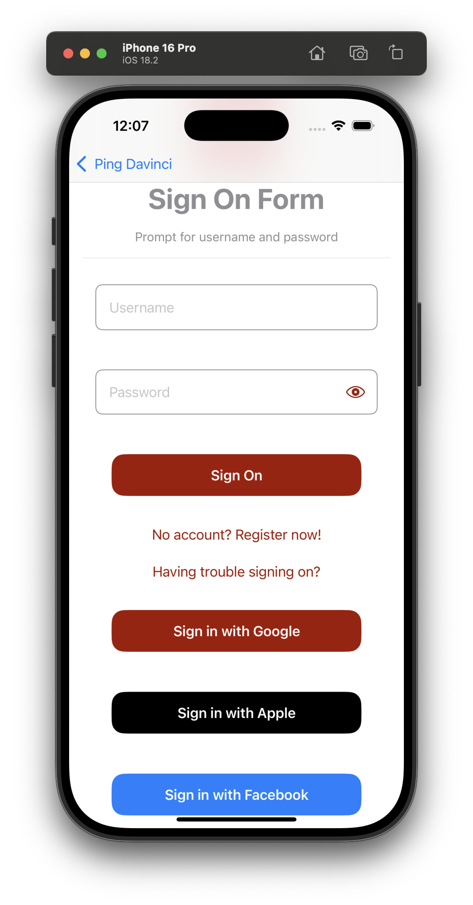

<p align="center">
  <a href="https://github.com/ForgeRock/ping-android-sdk">
    
  </a>
  <hr/>
</p>

# Ping External IDP

## Overview

The Ping External IDP library empowers your iOS applications to seamlessly authenticate users through various external Identity Providers (IDPs) such as Google, Facebook, and Apple. Acting as a plugin for the `PingDavinci` modules, it streamlines the integration process by providing the necessary configurations and functionalities to initiate and manage authentication flows with these external services.

This library abstracts away the complexities of dealing with different IDP protocols and SDKs, offering a unified and developer-friendly API. By leveraging Ping External IDP, you can enhance your application's user experience by offering familiar and convenient login options.



## Add dependency to your project

You can add the dependency using Cocoapods or Swift Package Manager

## Configuration and Usage

The `PingExternal-idp` library is designed to work in conjunction with the 'PingDavinci' module. The authentication flow is orchestrated by a DaVinci journey that includes an `IdpCollector` node. The configuration of the external IDPs is handled either within the PingOne platform directly or through DaVinci Connectors.

## Authentication Experience Options

*Browser Experience:* For authentication within a secure in-app web browser using `WebAuthenticationSession`. You only need to import `PingExternal-Idp` librtary for this.
*Native Experience:* For a more integrated, in-app authentication flow (e.g., using native Google or Facebook SDKs)
For Native experiences you need to import `PingExternal-Idp-Apple`, `PingExternal-Idp-Facebook` and `PingExternal-Idp-Google` libraries alongside the `PingExternal-idp`. See the end of the page for more info on this.

### PingOne External IDPs Setup

This method involves configuring the external IDPs within the PingOne administrative console. You'll need to register your application with each IDP (e.g., creating a Google Cloud Platform project and configuring OAuth 2.0 credentials). The redirect URIs configured in PingOne should match the custom url scheme you define in your iOS app.


### DaVinci Connector Setup

You configure the connector within your DaVinci environment, specifying the necessary details for each IDP (client IDs, secrets, etc.).


### DaVinci Flow Setup

In your DaVinci flow, you will need to include an `skIDP` in your html template or `Social Login` in the form. This component is responsible for initiating the authentication process with the configured External IDP. The flow will typically involve redirecting the user to the IDP for authentication and then processing the callback.


### Deep Linking Configuration (Application Return URL)

For the `IdpCollector` to correctly redirect the user back to your application after successful authentication, you need to configure the `Application Return to Url` within your PingOne or DaVinci setup. This URL should use a `Custom URL Scheme` that your app can handle. For example:

```swift
myapp://callback
```

### iOS App Redirect URI Scheme Setup

To enable your iOS app to handle the redirection after external authentication, you need to define a custom URI scheme in your app. In the App project file go to `Info -> URL Types` file, add the following `url scheme` to the project. The IdpCollector will use the first scheme as it appears on the list:


## Initiating the Authentication Flow

Within your application logic, when the user initiates the external IDP login, you will interact with the `IdpCollector` obtained from a `ContinueNode` in your DaVinci flow. 
Here's an example of how to use the `IdpCollector` instance:

```swift
public class SocialButtonViewModel: ObservableObject {
    @Published public var isComplete: Bool = false
    public let idpCollector: IdpCollector
    
    public init(idpCollector: IdpCollector) {
        self.idpCollector = idpCollector
    }
    
    public func startSocialAuthentication() async -> Result<Bool, IdpExceptions> {
        return await idpCollector.authorize()
    }
    
    public func socialButtonText() -> some View {
        let bgColor: Color
        switch idpCollector.idpType {
        case "APPLE":
            bgColor = Color.appleButtonBackground
        case "GOOGLE":
            bgColor = Color.googleButtonBackground
        case "FACEBOOK":
            bgColor = Color.facebookButtonBackground
        default:
            bgColor = Color.themeButtonBackground
        }
        let text = Text(idpCollector.label)
            .font(.headline)
            .foregroundColor(.white)
            .padding()
            .frame(width: 300, height: 50)
            .background(bgColor)
            .cornerRadius(15.0)
        
        return text
    }
}
```
The `idpCollector.authorize()` method initiates the authentication flow. For browser-based authentication, this will typically launch an `In-App Browser` to the IDP's login page.

## Handling the Authentication Result

The `authorize()` method returns a `Result` class, which can be either `.success` or `.failure`. `.failure` will contain `IdpExceptions` which shows the root cause of the issue.

```swift
Task {
    let result = await socialButtonViewModel.startSocialAuthentication()            
    switch result {
    case .success(_):
        onNext(true)
    case .failure(let error): //<- Exception
        onStart()
    }
}
```

### More IdpCollector configuration

When calling `await idpCollector.authorize()` developers can optionally pass a `callbackURLScheme` to override the configuration used by the collector. Example:
```swift
await idpCollector.authorize(callbackURLScheme: "myAppScheme")
``` 
The value needs to match with the configuration of the Social Provider.

## Native External Identity Providers (IDP) Integration with Google and Facebook and Apple for iOS

To provide a more seamless and integrated user experience, especially for frequently used IDPs like Google and Facebook, the Ping External IDP library can leverage their native iOS SDKs (if the corresponing PingExternal IDP *native library* is imported). This allows for a login flow that feels more integrated within the app, potentially avoiding full browser redirects.

By including one of the following libraries as dependencies, the Ping External IDP library can automatically detect their presence and utilize them for the authentication process when configured. If Ping External IDP native libraries are not included, Ping External IDP will gracefully fall back to the browser-based authentication flow using an in-app browser.

For implementing Native Signin with Apple see the [PingExternal-idp-Apple](/External-idp-Apple/README.md) module.

For implementing Native Signin with Google see the [PingExternal-idp-Google](/External-idp-Google/README.md) module.

For implementing Native Signin with Facebook see the [PingExternal-idp-Facebook](/External-idp-Facebook/README.md) module.
