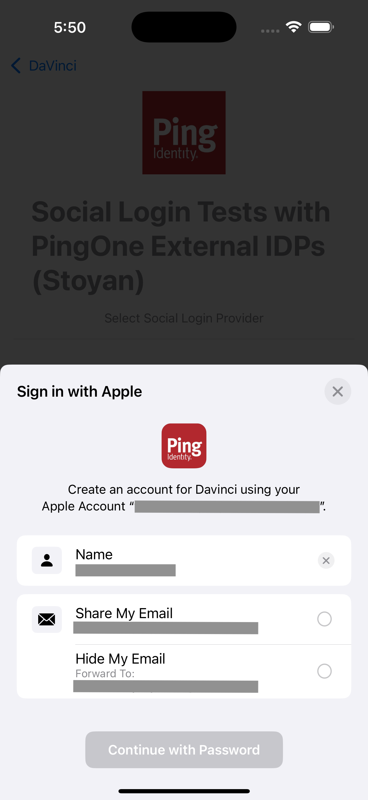

[](https://swift.org)
[](https://developer.apple.com/ios/)
[](../LICENSE)


# PingExternalIdPApple

## Overview

Ping External IDP Apple is a library that allows you to authenticate with External IDP for Apple using native Sign in With Apple.
This library acts as a plugin to the `PingExternalIdP` library, and it provides the necessary configuration to authenticate with `Sign In with Apple` natively.



## Getting Started

### Prerequisites

- iOS 16.0+
- Swift 6.0+
- Xcode 15+
- Sign in with Apple capability enabled in your Xcode project

### Installation

#### Swift Package Manager

```swift
dependencies: [
    .package(url: "https://github.com/ForgeRock/ping-ios-sdk.git", from: "<version>")
]
```

Then add the `PingExternalIdPApple` product to your target's dependencies. Make sure it is also included in the **Frameworks and Libraries** section of your target's General configuration pane in Xcode.

#### CocoaPods

```ruby
pod 'PingExternalIdPApple', '~> <version>'
```

## Usage

To use the `PingExternalIdPApple` with `IdpCollector`, you need to integrate with `PingDavinci` module.
Read more about Configuration and Usage in [PingExternalIdP](/ExternalIdP/README.md)

If the library is present in the project, calling `IdpCollector.authorize()` will use native Sign in With Apple to perform the authentication.

### Enable the SIWA capability in Xcode

In the App project file go to `Target -> Signing and Capabilities` file, add the `Sign in with Apple` capability.

Follow the PingOne and DaVinci documentation to configuring the External IDP or Davinci Connector with Apple for a Sign in with Apple integration.

## License

This software may be modified and distributed under the terms of the MIT license. See the LICENSE file for details.

© Copyright 2025-2026 Ping Identity Corporation. All Rights Reserved
