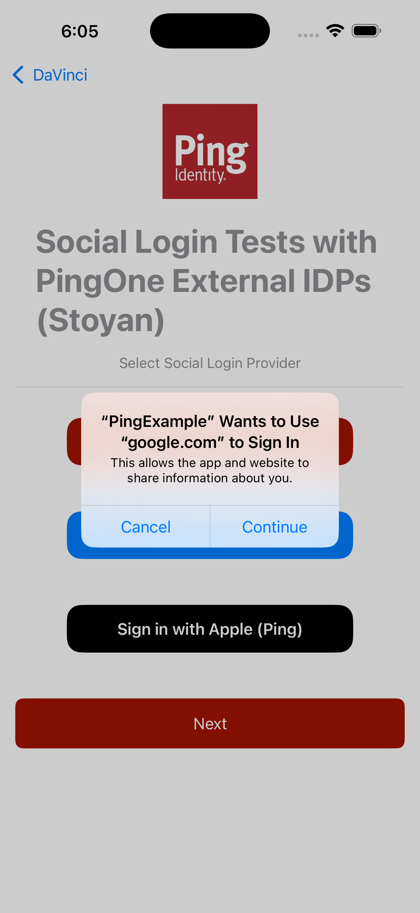
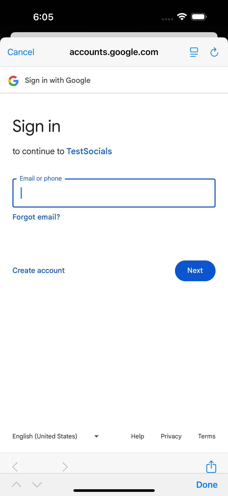
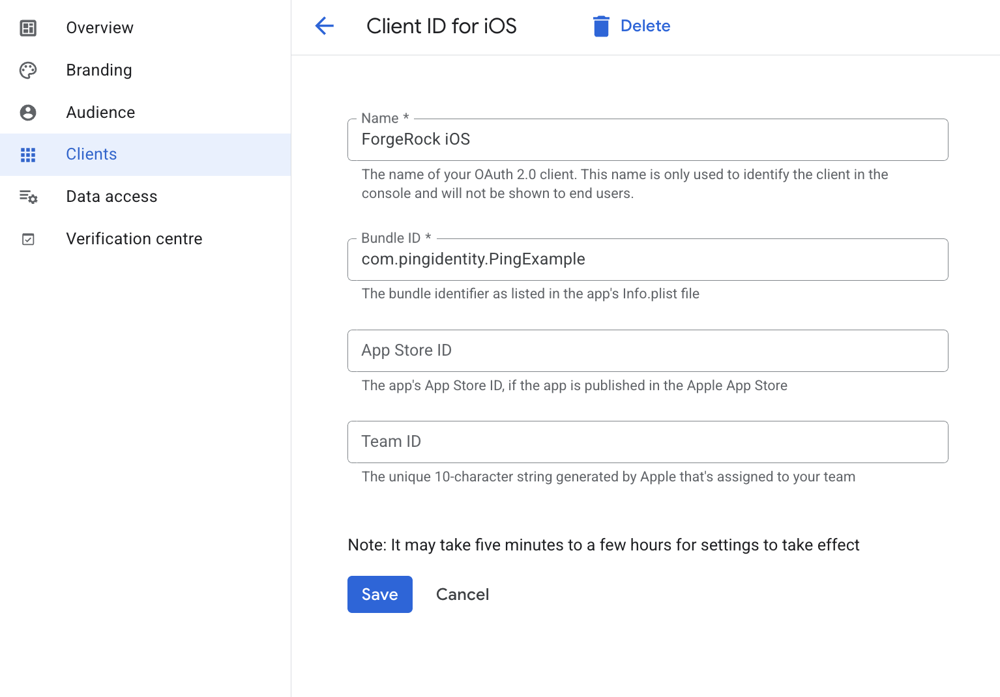

<p align="center">
  <a href="https://github.com/ForgeRock/ping-android-sdk">
    
  </a>
  <hr/>
</p>

# Ping External IDP Google

## Overview

Ping External IDP Google is a library that allows you to authenticate with External IDP for Google using the [GoogleSignIn-iOS](https://github.com/google/GoogleSignIn-iOS) SDK for Native iOS experience.
This library acts as a plugin to the `PingExternalIdP` library, and it provides the necessary configuration to authenticate with Google Sign In natively.

 

## Add dependency to your project

You can add the dependency using Cocoapods or Swift Package Manager.
Make sure the `PingExternalIdPGoogle` is included in the `Frameworks and Libraries` section of the `General` configuration pane in Xcode

## Usage

To use the `PingExternalIdPGoogle` with `IdpCollector`, you need to integrate with `PingDavinci` module.
Read more about Configuration and Usage in [PingExternalIdP](/ExternalIdP/README.md)

If the library is present in the project, calling `IdpCollector.authorize()` will use the Google Sign In SDK to perform the authentication.

## Google Developer Console Configuration for Native Integration

For Google native sign-in to work correctly, you need to configure **iOS client** credentials in your Google Cloud Platform project.



## Configuring `Info.plist`

Add the following strings to your app's Info file, replacing the placeholders with your
actual Google Client ID and Google Server Client ID:

```xml

  <key>GIDClientID</key>
	<string>[your_google_client_id]</string>
	<key>GIDServerClientID</key>
	<string>[your_google_server_client_id]</string>

  <key>CFBundleURLTypes</key>
  <array>
    <dict>
      <key>CFBundleURLSchemes</key>
      <array>
        <string>[your_dot_reversed_google_client_id]</string>
      </array>
    </dict>
  </array>

```

## Handle the authentication redirect URL

### UIKit: UIApplicationDelegate

```swift
func application(
  _ app: UIApplication,
  open url: URL, options: [UIApplication.OpenURLOptionsKey : Any] = [:]
) -> Bool {
  var handled = GoogleRequestHandler.handleOpenURL(UIApplication.shared, url: url, options: nil)
  if handled {
    return true
  }
...
}
```

### SwiftUI

```swift
@main
struct MyApp: App {

  var body: some Scene {
    WindowGroup {
      ContentView()
        // ...
        .onOpenURL { url in
          GoogleRequestHandler.handleOpenURL(UIApplication.shared, url: url, options: nil)
        }
    }
  }
}
}
```
