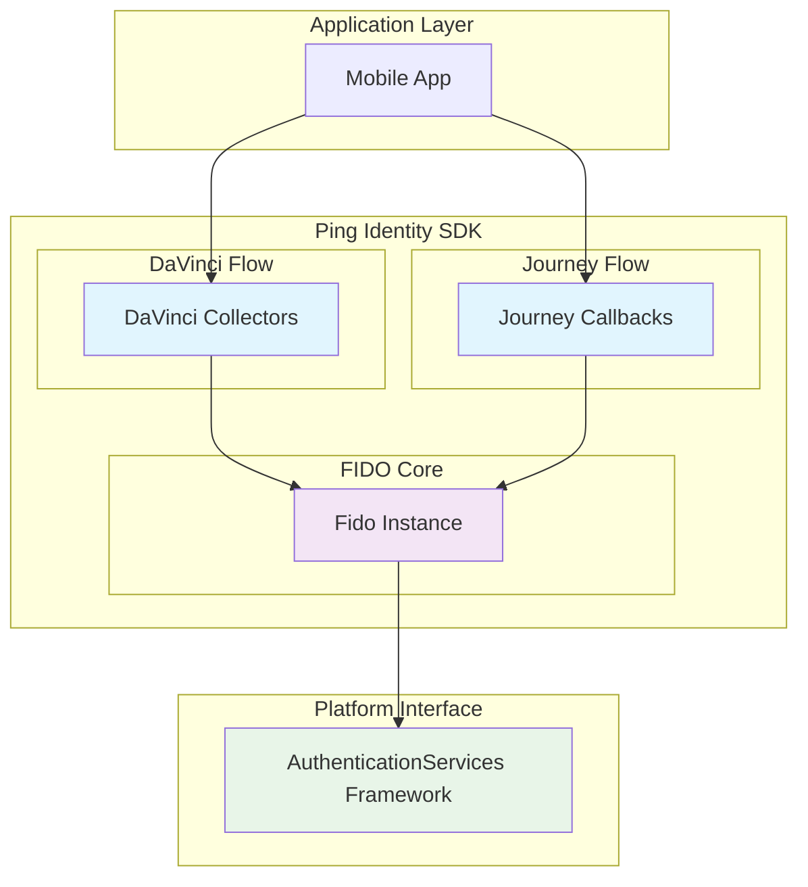
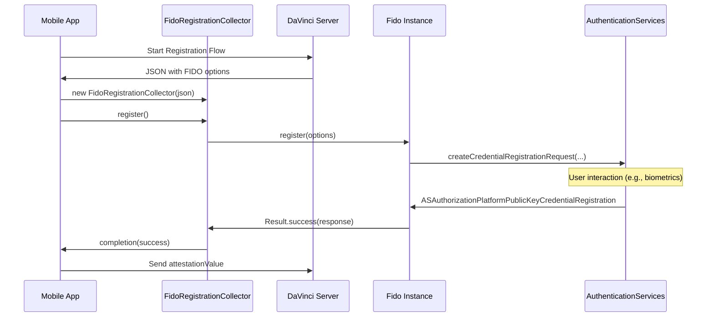
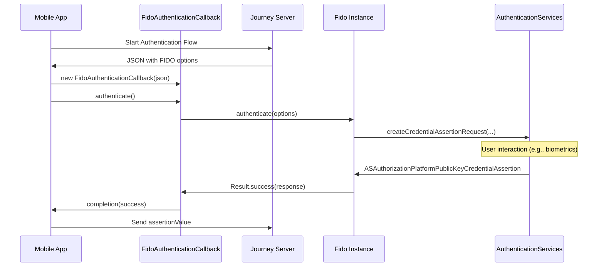

# FIDO Module Design Concept

This document explains the internal design and architecture of the FIDO module, focusing on how it integrates with the `AuthenticationServices` framework and the two main Ping Identity authentication flows: DaVinci and Journey.

## Overview

The FIDO module serves as a bridge between Ping Identity's authentication flows and Apple's native FIDO capabilities through the `AuthenticationServices` framework. It provides a high-level API for FIDO registration and authentication, abstracting the complexity of the underlying credential management system.

## Architecture Components

## Design Principles

### 1. Abstraction and Encapsulation

The `Fido` class encapsulates the interaction with the `AuthenticationServices` framework, providing a simple and clean API for FIDO operations.

### 2. Separation of Concerns

The module is divided into three main parts:
- **Core:** The `Fido` class that handles the FIDO operations.
- **DaVinci:** The collectors that integrate FIDO operations with the DaVinci flow.
- **Journey:** The callbacks that integrate FIDO operations with the Journey flow.

### 3. Testability

Dependency injection is used to allow for easy mocking of the `Fido` class, making the collectors and callbacks highly testable.

## Data Flow

### FIDO Registration Flow (DaVinci)

### FIDO Authentication Flow (Journey)

## Key Components Explained

### Core (`Fido.swift`)

- **Purpose**: Central coordinator for all FIDO operations.
- **Responsibilities**:
    - Manage the `AuthenticationServices` lifecycle.
    - Handle errors and exceptions consistently.
    - Provides a simple API for `register` and `authenticate`.

### DaVinci Integration (`Fido/Fido/Davinci`)

- **Purpose**: Integrates FIDO operations with the DaVinci orchestration engine.
- **Key Classes**:
    - `AbstractFidoCollector`: A factory class that creates the appropriate collector based on the `action` parameter from the server.
    - `FidoRegistrationCollector`: Handles the FIDO registration ceremony in a DaVinci flow.
    - `FidoAuthenticationCollector`: Handles the FIDO authentication ceremony in a DaVinci flow.

### Journey Integration (`Fido/Fido/Journey`)

- **Purpose**: Integrates FIDO operations with the Journey framework.
- **Key Classes**:
    - `FidoCallback`: Base class for FIDO callbacks, providing common functionality for error handling and value setting.
    - `FidoRegistrationCallback`: Handles FIDO registration in a Journey flow.
    - `FidoAuthenticationCallback`: Handles FIDO authentication in a Journey flow.
    - `CallbackInitializer`: Registers the FIDO callbacks with the Journey `CallbackRegistry`.
