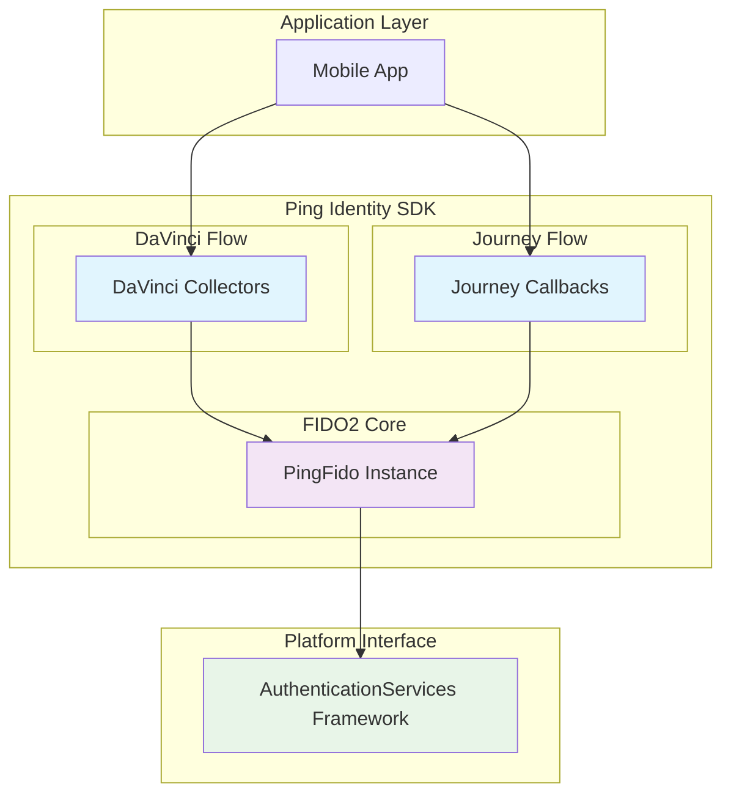
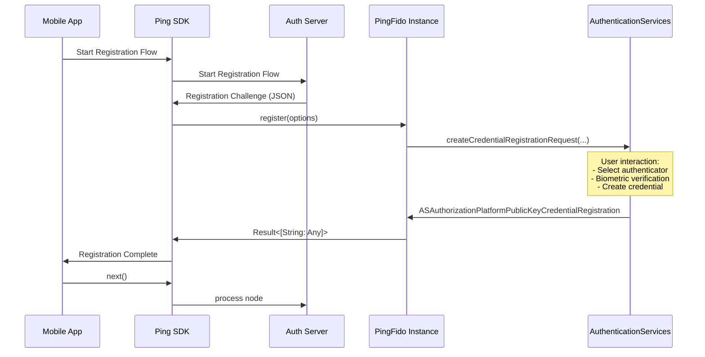

# FIDO2 Module Design Concept

This document explains the internal design and architecture of the FIDO2 module, focusing on how it integrates with the `AuthenticationServices` framework.

## Overview

The FIDO2 module serves as a bridge between Ping Identity's authentication flows (DaVinci and Journey) and Apple's native FIDO2 capabilities through the `AuthenticationServices` framework. The `PingFido` class acts as a proxy, abstracting the complexity of the underlying credential management system while providing a clean, consistent API for authentication operations.

## Architecture Components

### Component Diagram

## Design Principles

### 1. Proxy Pattern

The `PingFido` class acts as a proxy to the `AuthenticationServices` framework:

- **Abstraction**: Hides the complexity of the `AuthenticationServices` API.
- **Error Handling**: Provides consistent error handling and reporting.

### 2. Dependency Injection

Both DaVinci Collectors and Journey Callbacks will depend on configurable `PingFido` instances:

- **Loose Coupling**: Components depend on the abstraction, not the implementation.
- **Testability**: Easy to mock the `PingFido` instance for unit testing.
- **Consistency**: All authentication flows use the same underlying FIDO2 operations.

## Data Flow

### FIDO2 Registration Flow

### FIDO2 Authentication Flow

Similar to the registration flow, but calling `authenticate()` instead of `register()`.

## Key Components Explained

### PingFido

- **Location**: `Fido/Fido`
- **Purpose**: Central coordinator for all FIDO2 operations and Journey callbacks.
- **Responsibilities**:
    - Manage the `AuthenticationServices` lifecycle.
    - Handle errors and exceptions consistently.
    - Support both discoverable and non-discoverable credentials.
    - Provides the Journey callbacks for FIDO2 operations.
- **Key Classes**:
    - `PingFido.swift`: The main class that orchestrates the FIDO2 registration and authentication processes.
    - `FidoModels.swift`: Contains the data models for FIDO2 requests and responses.
    - `FidoConstants.swift`: Defines the constants used in the FIDO2 implementation.
    - `PingFido.h`: The header file for the module.
    - **Journey**: Contains the Journey callbacks for FIDO2 operations.
        - `Fido2Callback.swift`: Base class for FIDO2 callbacks.
        - `Fido2RegistrationCallback.swift`: Handles FIDO2 registration.
        - `Fido2AuthenticationCallback.swift`: Handles FIDO2 authentication.
        - `CallbackInitializer.swift`: Registers the FIDO2 callbacks with the Journey framework.

### DaVinci Collectors & Journey Callbacks

The integration with DaVinci is not yet implemented. The integration with Journey is handled by the `PingFido` module.

