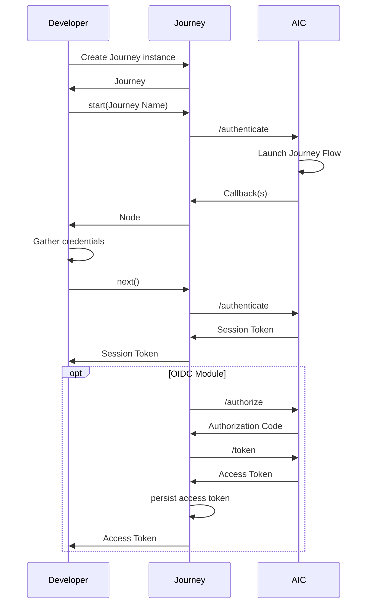
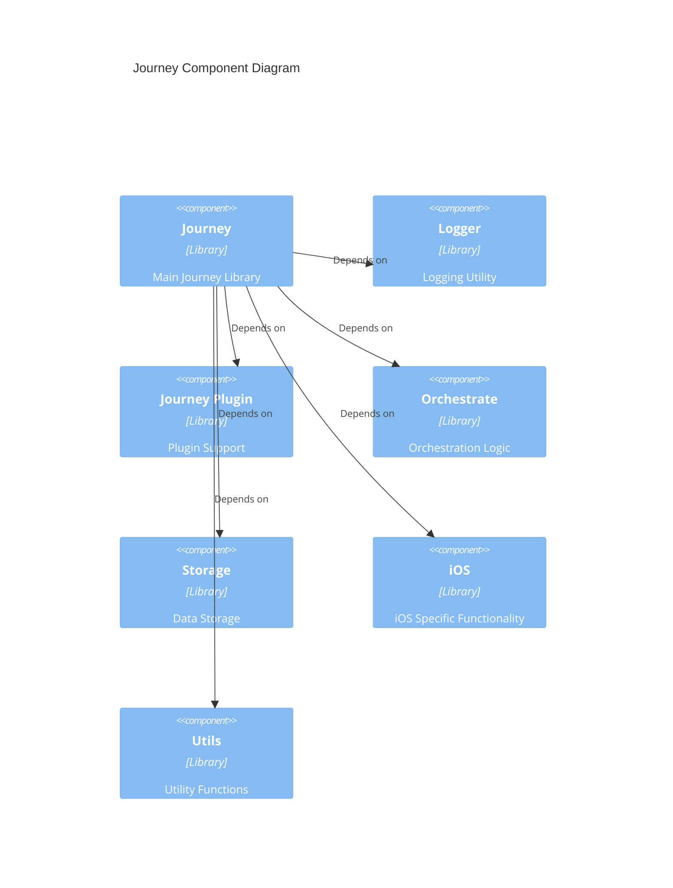

<p align="center">
  <a href="https://github.com/ForgeRock/ping-ios-sdk">
    
  </a>
  <hr/>
</p>

# Journey: Authentication and Authorization SDK

## Overview

**Journey** is a robust and adaptable library designed to streamline Authentication and
Authorization processes within your iOS applications. Engineered for ease of integration and
extensibility, it offers a straightforward API to manage authentication flows and handle the various
states encountered during this process.



For a deeper understanding of PingOne AIC Journeys, refer to the official documentation available
[here](https://docs.pingidentity.com/pingoneaic/latest/realms/journeys.html).

## Installation

### Add dependency to your project

To integrate Journey into your iOS project, add the following dependency to your
`Podfile` or `Package.swift` file:

```ruby
pod 'PingIdentityJourney', '<version>'
```
or for Swift Package Manager:
```swift
.package(url: "https://github.com/ForgeRock/ping-ios-sdk.git", from: "<version>")
```

Replace `<version>` with the latest version of the Journey SDK.

## Getting Started

### Basic Usage

To begin using the `Journey` class, instantiate it within your code, providing a configuration block
to customize its
behavior. This configuration allows you to set parameters such as network timeout and logging
preferences.

Here's a basic example of creating a `Journey` instance and initiating the authentication flow:

```swift
let journey = Journey {
    serverUrl = "https://openam-sdks.forgeblocks.com/am"
}
var node = journey.start("login") // Start the login authentication flow
node = node.next()
```

### Integrating the OIDC Module

Optionally, you can enhance the `Journey` instance with the `oidc` module. This module enables the
discovery of OpenID
Connect (OIDC) endpoints using the `discoveryEndpoint` attribute.

```swift
let journey = Journey {
    module(Oidc) {
        clientId = "your_client_id"
        discoveryEndpoint =
            "https://your_openam_domain/am/oauth2/alpha/.well-known/openid-configuration"
        scopes = ["openid", "email", "address", "profile", "phone"]
        redirectUri = "org.forgerock.demo:/oauth2redirect"
        // Add other OIDC configurations as needed
    }
}
```

### Advanced Journey Configuration

The `Journey` configuration block offers further customization options:

```swift
let journey = Journey {
    timeout = 30 // Network request timeout in seconds (default: 30s)
    logger = Logger.standard // Use the standard logger for output
    realm = "<realm_name>" // Specify the realm for authentication
    cookie = "<cookie_name>" // Specify the cookie name for session management
    module(Oidc) {
        clientId = "your_client_id"
        discoveryEndpoint =
                "https://your_openam_domain/am/oauth2/alpha/.well-known/openid-configuration"
        // ... other OIDC configurations
    }
}
```

### Navigating the Authentication Flow

The `start()` method initiates the authentication journey and returns a `Node` instance,
representing the current state
of the process. You can then use the `next()` method (available on `ContinueNode`) to transition to
the subsequent
state.

The `resume(uri)` method enables the continuation of an authentication flow after you've obtained a
resume URI, for
instance, through an Email Suspend Node.

Optionally, you can provide options when starting the journey, such as `forceAuth` and `noSession`

```swift
var node = journey.start("myLogin") {
    forceAuth = true
    noSession = true
} // Initiate the authentication journey

// Determine the type of the current Node
switch node {
case let continueNode as ContinueNode:
    // Proceed to the next step in the authentication journey
    let nextNode = continueNode.next()
case let errorNode as ErrorNode:
    // Handle server-side errors (e.g., invalid credentials)
    let errorMessage = errorNode.message
    let input = errorNode.input // Access the raw JSON response with the input attribute
    // Display error to the user
case let failureNode as FailureNode:
    // Handle unexpected errors (e.g., network issues, unexpected errors like parsing response)
    let errorCause = failureNode.cause
    // Log the error and potentially display a generic message
case let successNode as SuccessNode:
    // Authentication successful, retrieve the session
    let session = successNode.session
    let input = successNode.input // Access the raw JSON response with the input attribute
    // Proceed with post-authentication actions
default:
    break
}
```

The `Node` class represents various states within the authentication journey:

| Node Type    | Description                                                                                                                                     |
|--------------|:------------------------------------------------------------------------------------------------------------------------------------------------|
| ContinueNode | Indicates a step in the middle of the authentication journey. Call `node.next()` to advance to the next node.                                   |
| ErrorNode    | Represents a bad request from the server, such as invalid credentials (password, OTP, username). Access the error message using `node.message`. |
| FailureNode  | Signifies an unexpected error during the process, like network connectivity issues. Retrieve the underlying cause using `node.cause`.           |
| SuccessNode  | Indicates successful authentication. Obtain the user session details using `node.session`.                                                      |

### Providing User Input

When the current `Node` is a `ContinueNode`, it often contains a list of `callbacks` that require
user input. You can
access these callbacks using `node.callbacks()` and provide the necessary information to each
relevant callback.

The following Callback will be supported in the Core Journey Module:

| Callback Name                   | Callback Description                                                                                |
|---------------------------------|-----------------------------------------------------------------------------------------------------|
| AppIntegrity                    | Collects a generated token from the client to verify the integrity of the app                       |
| BooleanAttributeInputCallback   | Collects true or false.                                                                             |
| ChoiceCallback                  | Collects single user input from available choices, retrieves selected choice from user interaction. |
| ConfirmationCallback            | Retrieve a selected option from a list of options.                                                  |
| ConsentMappingCallback          | Prompts the user to consent to share their profile data.                                            |
| HiddenValueCallback             | Returns form values that are not visually rendered to the end user.                                 |
| KbaCreateCallback               | Collects knowledge-based answers. For example, the name of your first pet.                          |
| MetadataCallback                | Injects key-value metadata into the authentication process.                                         |
| NameCallback                    | Collects a username.                                                                                |
| NumberAttributeInputCallback    | Collects a number.                                                                                  |
| PasswordCallback                | Collects a password or one-time pass code.                                                          |
| PollingWaitCallback             | Instructs the client to wait for the given period and resubmit the request.                         |
| StringAttributeInputCallback    | Collects the values of attributes for use elsewhere in a tree.                                      |
| SuspendedTextOutputCallback     | Pause and resume authentication, sometimes known as "magic links".                                  |
| TextInputCallback               | Collects text input from the end user. For example, a nickname for their account.                   |
| TextOutputCallback              | Provides a message to be displayed to a user with a given message type.                             |
| TermsAndConditionsCallback      | Collects a user’s acceptance of the configured Terms & Conditions.                                  |
| ValidatedCreatePasswordCallback | Collects a password value with optional password policy validation.                                 |
| ValidatedCreateUsernameCallback | Collects a username value with optional username policy validation.                                 |

Here's how to access and populate the callbacks:

```swift
node.callbacks.forEach { callback in
    switch callback {
    case let nameCallback as NameCallback:
        nameCallback.name = "Your Username"
    case let passwordCallback as PasswordCallback:
        passwordCallback.password = "Your Password"
    // Handle other callback types as they are introduced
    default:
        break
    }
}

// Proceed to the next Node with the provided input
let nextNode = node.next()
```

Each specific callback type provides its own properties for accessing labels and setting values.

#### NameCallback

```swift
let prompt = (callback as? NameCallback)?.prompt // Access the prompt/label
(callback as? NameCallback)?.name = "Your Input" // Set the user's input
```

#### PasswordCallback

`PasswordCallback` offers similar properties to `NameCallback`:

```swift
let prompt = (callback as? PasswordCallback)?.prompt // Access the prompt/label
(callback as? PasswordCallback)?.password = "Your Secret" // Set the user's password
```

### Handling Errors

The Journey SDK distinguishes between `FailureNode` and `ErrorNode` for different types of errors
encountered during the
authentication flow.

A `FailureNode` indicates an unexpected issue that prevents the journey from continuing. This could
stem from network
problems, data parsing errors, or internal SDK issues. In such cases, you can access the underlying
`Error` that
caused the error using `node.cause`. It's generally recommended to display a user-friendly generic
error message and
log the details for support investigation.

An `ErrorNode`, on the other hand, signifies an error response from the authentication server (
typically an HTTP 4xx or
5xx status code). These errors often relate to invalid user input or issues on the server side. You
can retrieve the
specific error message provided by the server using `node.message` and access the raw JSON
response via `node.input`.

```swift
let node = journey.start() // Initiate the authentication flow

switch node {
case let continueNode as ContinueNode:
    // ...
    break
case let errorNode as ErrorNode:
    let errorMessage = errorNode.message // Retrieve the server-provided error message
    let rawResponse = errorNode.input // Access the raw JSON error response
    // Display the specific error message to the user
case let failureNode as FailureNode:
    let errorCause = failureNode.cause // Retrieve the underlying error
    // Log the errorCause for debugging
    // Display a generic error message to the user
case let successNode as SuccessNode:
    // ...
    break
default:
    break
}
```

### Integration with SwiftUI

For applications using SwiftUI, you can seamlessly integrate the Journey SDK using an
`ObservableObject` to manage the
UI state.

#### ViewModel

```swift
class AuthViewModel: ObservableObject {
    @Published var state: Node = Empty()
    private var journey: Journey!

    func initializeJourney() {
        journey = Journey {
            // Configure your Journey instance here
            serverUrl = "YOUR_SERVER_URL"
            // ... other configurations
        }
    }

    func startJourney(flowName: String = "login") {
        Task {
            let nextNode = journey.start(flowName)
            DispatchQueue.main.async {
                self.state = nextNode
            }
        }
    }

    func next(node: ContinueNode, input: [String: String] = [:]) {
        Task {
            let nextNode = node.next(input)
            DispatchQueue.main.async {
                self.state = nextNode
            }
        }
    }
}
```

#### View (SwiftUI)

```swift
import SwiftUI

struct AuthScreen: View {
    @StateObject private var viewModel = AuthViewModel()

    var body: some View {
        VStack {
            switch viewModel.state {
            case let node as ContinueNode:
                // Render UI elements based on the callbacks in the node
                // Example: Display text fields for NameCallback and PasswordCallback
                let callbacks = node.callbacks
                // ... UI logic to collect user input and call viewModel.next()
            case let node as ErrorNode:
                // Display the error message
                Text("Authentication Error: \(node.message)")
            case let node as FailureNode:
                // Display a generic error message
                Text("An unexpected error occurred.")
                // Optionally log the errorCause
                print("Authentication Failure: \(node.cause)")
            case is SuccessNode:
                // Navigate to the main application screen
                Text("Authentication Successful!")
                // ... Navigation logic
            default:
                EmptyView()
            }
        }
        .onAppear {
            viewModel.initializeJourney()
            viewModel.startJourney()
        }
    }
}
```

### Post Authentication Operations

After successful authentication using the `Oidc` module, the user's session information is typically
stored securely.
The `Journey` instance provides methods to interact with this stored session.

```swift
// Retrieve the existing user session. If an active session cookie (ST) exists, 'user' will not be nil.
// Note: Even if a user object is retrieved, the access and refresh tokens within might be expired.
let user: User? = journey.user()
let session: SSOToken? = user?.ssoToken() // Retrieve the SSO token if available

if let user = user {
    let accessToken = user.accessToken() // Retrieve the current access token
    user.revoke() // Revoke the current access and refresh tokens
    user.userinfo() // Fetch user information using the access token (if valid)
    user.logout() // Initiate the logout process, potentially clearing local session data
}
```

### Journey Module Dependencies

The `Journey` module has several dependencies that are essential for its functionality.



* [Logger](https://github.com/ForgeRock/ping-ios-sdk/tree/develop/foundation/logger)
* [journey-plugin](https://github.com/ForgeRock/ping-ios-sdk/tree/develop/foundation/journey-plugin)
* [Oidc](https://github.com/ForgeRock/ping-ios-sdk/tree/develop/foundation/oidc)
* [Orchestrate](https://github.com/ForgeRock/ping-ios-sdk/tree/develop/foundation/orchestrate)
* [Storage](https://github.com/ForgeRock/ping-ios-sdk/tree/develop/foundation/storage)
* [Utils](https://github.com/ForgeRock/ping-ios-sdk/tree/develop/foundation/utils)
* [iOS](https://github.com/ForgeRock/ping-ios-sdk/tree/develop/foundation/ios)

### Journey's Callback Customization & Extension

Please refer to [journey-plugin](https://github.com/ForgeRock/ping-ios-sdk/tree/develop/foundation/journey-plugin)
for customizing the Journey's callback.

Callback below will be supported by other modules:

| Callback Name                    | Callback Description                                                           |
|----------------------------------|--------------------------------------------------------------------------------|
| AppIntegrity                     | Collects a generated token from the client to verify the integrity of the app  |
| DeviceBinding                    | Cryptographically bind a mobile device to a user account.                      |
| DeviceProfileCallback            | Collects meta and/or location data about the authenticating device.            |
| DeviceSigningVerifier            | Verify ownership of a bound device by signing a challenge.                     |
| PingOneProtectEvaluationCallback | Collects captured contextual data from the client to perform risk evaluations. |
| PingOneProtectInitializeCallback | Instructs the client to start capturing contextual data for risk evaluations   |
| ReCaptchaCallback                | Provides data required to use a CAPTCHA in your apps.                          |
| ReCaptchaEnterpriseCallback      | Provides data required to use reCAPTCHA Enterprise in your apps.               |
| WebAuthnRegistrationCallback     | WebAuthn Registration.                                                         |
| WebAuthnAuthenticationCallback   | WebAuthn Authentication.                                                       |
| SelectIdpCallback                | External Identity provider selection.                                          |
| IdpCallback                      | External Identity provider authentication.                                     |


