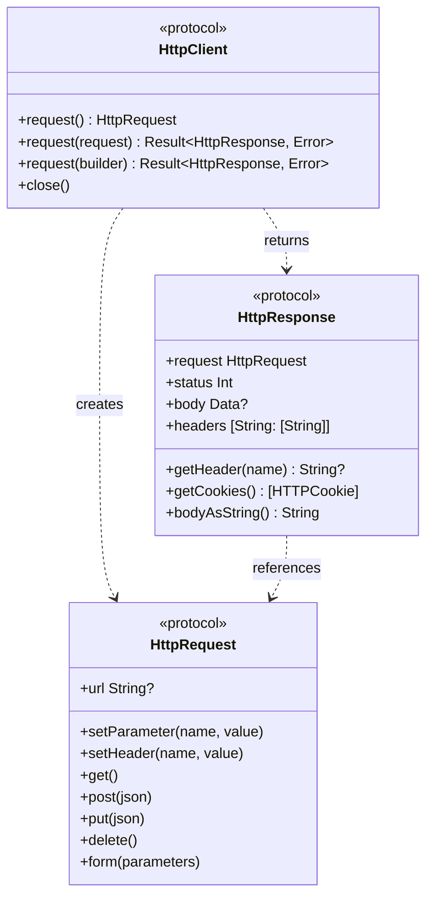
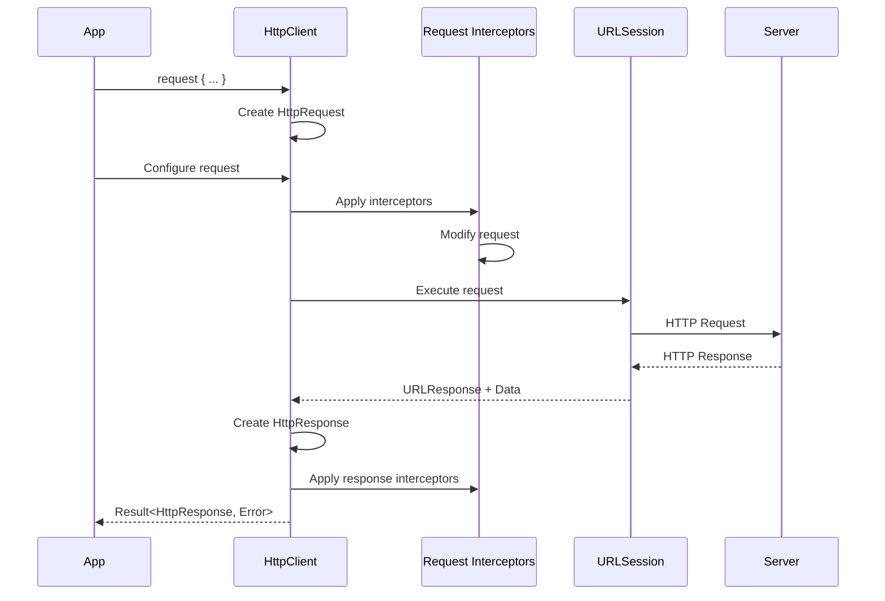

# Ping SDK – Network Module

[](https://swift.org)
[](https://developer.apple.com/ios/)
[](../LICENSE)

## Overview

PingNetwork provides a protocol-based HTTP client abstraction for the Ping iOS SDK. It offers a Swift-idiomatic interface for making HTTP requests with support for async/await, request/response interceptors, and automatic injection of standard headers.

The module is built on Apple's native URLSession framework, ensuring zero external dependencies while providing excellent performance and seamless integration with iOS.

## Key Features

- **Protocol-Based Design**: Flexible abstractions enable easy testing and custom implementations
- **Swift Concurrency**: Native async/await support for all network operations
- **Request/Response Interceptors**: Add cross-cutting concerns like authentication, logging, and error handling
- **Standard Headers**: Automatically injects platform identification headers (`x-requested-with`, `x-requested-platform`)
- **Builder Pattern**: Fluent API for constructing HTTP requests
- **Type-Safe Methods**: Enum-based HTTP methods (GET, POST, PUT, DELETE, etc.)
- **Cookie Management**: Built-in cookie handling via URLSession
- **Redirect Prevention**: Automatic prevention of HTTP redirects for security
- **Thread-Safe**: Full `Sendable` conformance for Swift 6+ concurrency
- **Zero Dependencies**: Uses only native iOS frameworks

## Integrating the SDK into your project

Use Cocoapods or Swift Package Manager

### Swift Package Manager

```swift
dependencies: [
    .package(url: "https://github.com/ForgeRock/ping-ios-sdk.git", from: "1.0.0")
],
targets: [
    .target(
        name: "YourTarget",
        dependencies: [
            .product(name: "PingNetwork", package: "ping-ios-sdk")
        ]
    )
]
```

### CocoaPods

```ruby
pod 'PingNetwork'
```

## How to Use the SDK

### Basic HTTP Request

Make a simple GET request:

```swift
import PingNetwork

let client = HttpClient.createClient()

let result = await client.request { request in
    request.url = "https://api.example.com/users"
    request.get()
}

switch result {
case .success(let response):
    print("Status: \(response.status)")
    print("Body: \(response.bodyAsString())")
case .failure(let error):
    print("Error: \(error)")
}
```

### POST Request with JSON Body

Send a POST request with a JSON body:

```swift
let result = await client.request { request in
    request.url = "https://api.example.com/users"
    request.setHeader(name: "Content-Type", value: "application/json")
    request.post(json: [
        "name": "John Doe",
        "email": "john@example.com"
    ])
}
```

### Form-Encoded POST Request

Submit form data:

```swift
let result = await client.request { request in
    request.url = "https://api.example.com/login"
    request.form(parameters: [
        "username": "user@example.com",
        "password": "secret123"
    ])
}
```

### Adding Query Parameters

Add query parameters to a request:

```swift
let result = await client.request { request in
    request.url = "https://api.example.com/search"
    request.setParameter(name: "q", value: "swift")
    request.setParameter(name: "page", value: "1")
    request.get()
}
// Executes: GET https://api.example.com/search?q=swift&page=1
```

### Adding Headers

Set custom headers:

```swift
let result = await client.request { request in
    request.url = "https://api.example.com/protected"
    request.setHeader(name: "Authorization", value: "Bearer \(token)")
    request.setHeader(name: "Accept", value: "application/json")
    request.get()
}
```

### Configuring the HTTP Client

Create a client with custom configuration:

```swift
let client = HttpClient.createClient { config in
    config.timeout = 30.0  // Set timeout to 30 seconds
    config.logger = LogManager.standard  // Enable logging
}
```

### Request Interceptors

Add request interceptors to modify all outgoing requests:

```swift
let client = HttpClient.createClient { config in
    // Add authentication token to all requests
    config.onRequest { request in
        request.setHeader(name: "Authorization", value: "Bearer \(token)")
    }
    
    // Add custom user agent
    config.onRequest { request in
        request.setHeader(name: "User-Agent", value: "MyApp/1.0")
    }
}
```

Request interceptors are executed in the order they are registered, before the request is sent to the server.

### Response Interceptors

Add response interceptors to process all responses:

```swift
let client = HttpClient.createClient { config in
    // Log all responses
    config.onResponse { response in
        print("Response: \(response.status) - \(response.request.url?.absoluteString ?? "")")
    }
    
    // Extract and store cookies
    config.onResponse { response in
        let cookies = response.getCookies()
        storeCookies(cookies)
    }
}
```

Response interceptors are executed in the order they are registered, after the response is received from the server.

### Working with Responses

Access response data:

```swift
let result = await client.request { request in
    request.url = "https://api.example.com/data"
    request.get()
}

switch result {
case .success(let response):
    // Check status
    if response.status.isSuccess() {
        // Get body as string
        let bodyString = response.bodyAsString()
        
        // Get raw body data
        if let bodyData = response.body {
            let json = try? JSONSerialization.jsonObject(with: bodyData)
        }
        
        // Get specific header
        if let contentType = response.getHeader(name: "Content-Type") {
            print("Content-Type: \(contentType)")
        }
        
        // Get all headers
        let allHeaders = response.headers
        
        // Get cookies
        let cookies = response.getCookies()
        let cookieStrings = response.getCookieStrings()
    }
    
case .failure(let error):
    print("Request failed: \(error)")
}
```

### Status Code Checking

Use convenience methods to check response status:

```swift
if response.status.isSuccess() {
    // 2xx status code
} else if response.status.isRedirect() {
    // 3xx status code
} else if response.status.isClientError() {
    // 4xx status code
} else if response.status.isServerError() {
    // 5xx status code
}
```

### Closing the Client

Clean up resources when done:

```swift
client.close()
```

## Advanced Usage

### Custom HTTP Client Implementation

Create a custom HTTP client by implementing the `HttpClient` protocol:

```swift
class MyCustomHttpClient: HttpClient {
    func request() -> HttpRequest {
        MyCustomHttpRequest()
    }
    
    func request(request: HttpRequest) async -> Result<HttpResponse, Error> {
        // Custom implementation
    }
    
    func request(builder: @escaping @Sendable (HttpRequest) -> Void) async -> Result<HttpResponse, Error> {
        let request = self.request()
        builder(request)
        return await self.request(request: request)
    }
    
    func close() {
        // Clean up resources
    }
}
```

### Reusing HttpRequest Objects

Build a request and execute it separately:

```swift
let request = client.request()
request.url = "https://api.example.com/users"
request.setHeader(name: "Accept", value: "application/json")
request.get()

let result = await client.request(request: request)
```

### Error Handling

Handle different types of network errors:

```swift
let result = await client.request { request in
    request.url = "https://api.example.com/data"
    request.get()
}

switch result {
case .success(let response):
    if !response.status.isSuccess() {
        // HTTP error (4xx, 5xx)
        print("HTTP Error: \(response.status)")
    }
    
case .failure(let error):
    if let networkError = error as? NetworkError {
        switch networkError {
        case .timeout:
            print("Request timed out")
        case .invalidRequest(let message):
            print("Invalid request: \(message)")
        case .networkError(let underlying):
            print("Network error: \(underlying)")
        case .invalidResponse(let message):
            print("Invalid response: \(message)")
        }
    }
}
```

## Architecture

### Core Protocols



### Request Lifecycle



## Available HTTP Methods

| Method  | Method Call               | Description                                      |
|---------|---------------------------|--------------------------------------------------|
| GET     | `request.get()`           | Retrieve data from a server                      |
| POST    | `request.post(json:)`     | Send data to create a resource                   |
| PUT     | `request.put(json:)`      | Send data to update a resource                   |
| DELETE  | `request.delete()`        | Remove a resource from the server                |
| PATCH   | `request.setMethod(.patch)` | Partially update a resource                    |
| HEAD    | `request.setMethod(.head)`  | Retrieve headers without body                  |
| OPTIONS | `request.setMethod(.options)` | Get supported HTTP methods                   |

## Standard Headers

All requests automatically include the following headers:

| Header                | Value      | Description                        |
|-----------------------|------------|------------------------------------|
| x-requested-with      | ping-sdk   | Identifies requests from the SDK   |
| x-requested-platform  | ios        | Identifies the iOS platform        |

These headers help servers identify and process SDK requests appropriately.

## Thread Safety

All PingNetwork types conform to Swift's `Sendable` protocol, ensuring thread-safe usage in concurrent contexts:

- **HttpClient**: Can be safely shared across actors and tasks
- **HttpRequest**: Sendable for concurrent configuration
- **HttpResponse**: Immutable and safely shareable
- **Interceptors**: Must be `@Sendable` closures

## Performance Considerations

- **Connection Pooling**: URLSession automatically manages connection reuse
- **Request Timeout**: Default 15 seconds (configurable per client)
- **Non-Blocking**: All operations use async/await for efficient concurrency
- **Memory Efficient**: Responses loaded in memory (suitable for typical SDK use cases)
- **Logging Overhead**: Use appropriate log levels in production (WARN or ERROR)

## Security

### HTTPS/TLS

All network communication uses HTTPS by default. URLSession handles certificate validation and TLS negotiation automatically.

### Redirect Prevention

HTTP redirects are automatically prevented to avoid redirect-based attacks. If you need to handle redirects, implement custom logic in response interceptors.

### Cookie Security

Cookies are managed securely through URLSession's cookie storage. Use `getCookies()` to access cookies when needed.

### Sensitive Data

- Never log sensitive information (tokens, passwords) in request/response interceptors
- Use appropriate log levels in production environments
- Consider filtering sensitive headers in logger interceptors

## Testing

### Unit Testing

Mock the `HttpClient` protocol for testing:

```swift
class MockHttpClient: HttpClient {
    var mockResponse: Result<HttpResponse, Error>?
    
    func request() -> HttpRequest {
        MockHttpRequest()
    }
    
    func request(request: HttpRequest) async -> Result<HttpResponse, Error> {
        return mockResponse ?? .failure(NetworkError.invalidRequest("No mock response set"))
    }
    
    func request(builder: @escaping @Sendable (HttpRequest) -> Void) async -> Result<HttpResponse, Error> {
        let request = self.request()
        builder(request)
        return await self.request(request: request)
    }
    
    func close() {}
}
```

### URLProtocol Mocking

For more realistic testing, use URLProtocol to mock URLSession responses:

```swift
class MockURLProtocol: URLProtocol {
    static var requestHandler: ((URLRequest) throws -> (HTTPURLResponse, Data))?
    
    override class func canInit(with request: URLRequest) -> Bool {
        return true
    }
    
    override class func canonicalRequest(for request: URLRequest) -> URLRequest {
        return request
    }
    
    override func startLoading() {
        guard let handler = MockURLProtocol.requestHandler else {
            return
        }
        
        do {
            let (response, data) = try handler(request)
            client?.urlProtocol(self, didReceive: response, cacheStoragePolicy: .notAllowed)
            client?.urlProtocol(self, didLoad: data)
            client?.urlProtocolDidFinishLoading(self)
        } catch {
            client?.urlProtocol(self, didFailWithError: error)
        }
    }
    
    override func stopLoading() {}
}

// Register in your tests
URLProtocol.registerClass(MockURLProtocol.self)
```

## Migration from Old HttpClient

If you're migrating from a previous version, here are the key changes:

### URL Property

**Before:**
```swift
request.url = URL(string: "https://api.example.com")
```

**After:**
```swift
request.url = "https://api.example.com"
```

### JSON Body Methods

**Before:**
```swift
request.post(body: jsonData)
```

**After:**
```swift
request.post(json: ["key": "value"])
```

### Multi-Value Headers

**Before:**
```swift
let headers: [String: String] = response.headers
```

**After:**
```swift
let headers: [String: [String]] = response.headers
let firstValue = headers["Content-Type"]?.first
```

## Platform Requirements

- **iOS**: 16.0+
- **Swift**: 6.0+
- **Xcode**: 15+

## License

This project is licensed under the MIT License - see the [LICENSE](../LICENSE) file for details.

